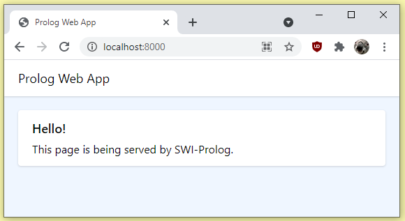

# Prolog Web Application

Implemented with SWI-Prolog and its HTTP server libraries.



## Usage

Consult `run.pl`, and then visit the site at [localhost:8000](http://localhost:8000).

```prolog
?- consult('run.pl').
% Started server at http://localhost:8000/

```

You can use `stop(8000).` to shut down the server. This will free the port.

## Structure

The `run.pl` file loads `server.pl` and then uses its `serve` predicate on port 8000.

```prolog
% run.pl

% Load the web server.
:- [server].

% Serve it at port 8000.
:- serve(8000).

```

The server is responsible for initialising each web app and its static files.

```prolog
% server.pl

% Load web app modules.
:- [app/init].

...

% Predicate to start the server.
serve(Port) :-
    http_server(http_dispatch, [port(Port)]).

% Predicate to stop the server.
stop(Port) :-
    http_stop_server(Port, []).

```

### Apps

Each app is a module that contains its own routes and views.

```prolog
% app/urls.pl

% Import views.
:- [views].

% Register paths
:- http_handler(root(.), index, []).

```

The idea is to implement template rendering in the future. 

For now, a view just renders plain old HTML code.

```prolog
% app/views.pl

% Import required HTTP module.
:- use_module(library(http/html_write)).

index(_Request) :-
	reply_html_page(
	    [
            title('Prolog Web App'),
            link([
                id("TailwindCSS"), 
                rel("stylesheet"), 
                href("static/tailwind.min.css")
            ])
        ],
        ...
```

### Static files

An app contains its own static files. The server registers each app's static files when initialised.

```prolog
% server.pl

% Load web app modules.
:- [app/init].

% Serve static files for each web app module.
:- http_handler('/static', serve_static, [prefix]).

serve_static(Request) :-
    http_reply_from_files('app/static/app', [], Request).

serve_static(Request) :-
    http_404([], Request).

```

**Why?** Static files have a single purpose, which is to be served as-is. There's no app-specific rendering or templating. Having each app implement its own static file logic would break the [DRY principle](https://en.wikipedia.org/wiki/Don%27t_repeat_yourself).

